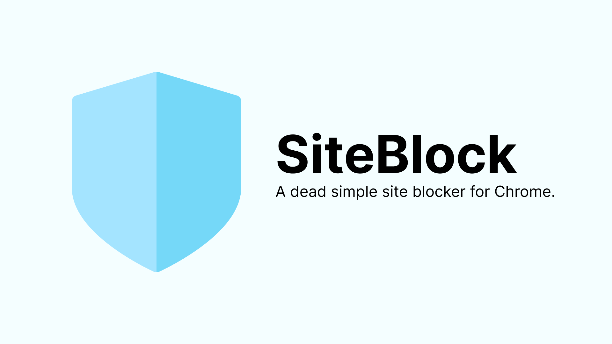

# SiteBlock

> **SiteBlock** is a simple Chrome extension that lets you block websites.

### Options

To open Options, **right-click** on the **SiteBlock** icon in the toolbar and choose **Options** from the menu.

### Installation

- Go to Chrome Settings using three dots on the top right corner.
- Then select extensions.
- You may directly open extensions using [`chrome://extensions`](chrome://extensions)
- Enable developer mode
- Click on Load Unpacked and select your Unzip folder.

The extension should be installed now.

---

